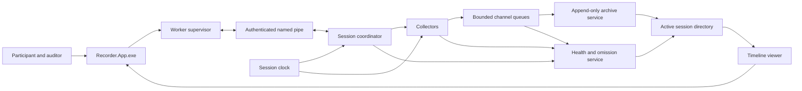

# Prototype Architecture

## Decision status

- **Status:** Proposed for prototype
- **Related issue:** [Define prototype architecture and collector contracts](https://github.com/bobdodd/windows-a11y-recorder/issues/1)
- **Scope:** Windows 10 and Windows 11, x64, platform and instrumented-browser recording
- **Companion documents:** [Implementation stack](windows-implementation-stack.md) and [collector contracts](collector-contracts.md)

## Architecture decision

The prototype will be one installed Windows product containing the recorder processes and a bundled instrumented Chromium build:

- `Recorder.App.exe` owns the accessible user interface, consent, session control, worker supervision, and archive review.
- `Recorder.CaptureHost.exe` owns the session clock, collectors, sequence allocation, evidence persistence, checkpoints, diagnostics, and recovery metadata.
- The instrumented Chromium process tree owns browser listener, dispatch, default-action, timer, DOM, accessibility, cookie, network, and rendering observations.

All capture runs locally. No capture path requires a screen-reader add-on, browser extension, external browser driver, network service, or administrator privileges. Browser tests run in the instrumented Chromium build included in the same installation.

The active recording is an append-only directory. Raw evidence is written once and never revised. Derived and inferred data are created only after capture and stored separately.

## Component ownership

| Component | Process | Responsibility | Initial channel |
| --- | --- | --- | --- |
| Session controller | App | Consent, configuration, start, pause, resume, annotate, stop, and status | Control only |
| Worker supervisor | App | Launch, authenticate, monitor, and terminate the capture host | Control and health |
| Timeline viewer | App | Review synchronized evidence, diagnostics, and omissions | Read-only |
| Session coordinator | Capture host | Session state, collector policy, readiness, and sequencing | Control |
| Session clock | Capture host | Monotonic time, wall-clock anchors, and timestamp mapping | Clock |
| Raw input collector | Capture host | Keyboard and conventional mouse Raw Input | Input |
| Context collector | Capture host | Foreground window, process, bounds, display, and session transitions | Environment |
| Video collector | Capture host | Display or selected-window frames and encoding | Video |
| Microphone collector | Capture host | Participant microphone samples | Audio |
| System-audio collector | Capture host | Shared render-loopback samples | Audio |
| Process-audio collector | Capture host | Selected screen-reader process-tree loopback | Audio |
| Accessibility collector | Capture host | UI Automation events and bounded snapshots | Accessibility |
| Browser evidence receiver | Capture host | Authenticate browser IPC, map browser clocks, validate records, and report omissions | Browser |
| Instrumented Chromium | Browser process tree | Observe browser-internal listeners, dispatch, default actions, timers, DOM, accessibility, cookies, network, and rendering | Browser |
| Annotation receiver | Capture host | Tester annotations received from the app | Annotation |
| Archive service | Capture host | Append-only persistence, segment rotation, checkpoints, and validation | Storage |
| Health service | Capture host | Collector state, omissions, queue pressure, timing, and resource telemetry | Diagnostics |

Touch, pen, precision-touchpad, and Raw HID collectors may be added through the same collector contract. They are not required for the initial implementation.

## Component and data flow



In text, the app sends versioned control commands over an authenticated local named pipe. The capture host validates the requested policy, initializes the archive, starts collectors, and returns status. Collectors stamp observations against the shared clock and enqueue immutable records or media buffers. Archive writers persist each stream and emit checkpoints. A separate health path records state transitions, queue pressure, omissions, mapping error, and resource measurements. The viewer reads completed or recoverable archives without modifying raw evidence.

High-volume evidence does not travel through the app process or named pipe. The pipe carries commands, acknowledgements, health summaries, and deliberately rate-limited preview data only.

## Session states

The session coordinator uses this state model:

```text
Idle
  -> Preparing
  -> Ready
  -> Recording
  -> Pausing
  -> Paused
  -> Resuming
  -> Recording
  -> Stopping
  -> Finalizing
  -> Completed

Preparing | Ready | Recording | Pausing | Paused | Resuming
  -> Aborting
  -> Recoverable

Any state
  -> Faulted
```

- **Idle:** No active session directory or capture host.
- **Preparing:** Policy is validated, the directory is reserved, and collectors initialize.
- **Ready:** Required collectors are ready and optional collector limitations are known.
- **Recording:** Evidence is accepted and persisted.
- **Pausing:** Collectors are reaching a defined pause boundary.
- **Paused:** User input and media evidence are not captured. Health, control, and pause markers continue.
- **Resuming:** Collectors reacquire devices and establish new timing anchors.
- **Stopping:** No new ordinary evidence is accepted after the stop boundary.
- **Finalizing:** Writers drain, media segments close, and the validator runs.
- **Completed:** The archive has a terminal manifest and validation result.
- **Aborting:** Best-effort stop after cancellation or unrecoverable control failure.
- **Recoverable:** The archive is incomplete but has enough journal and checkpoint data to reopen.
- **Faulted:** No trustworthy archive root or recovery record could be produced.

Every accepted control command receives one acknowledgement containing the command identifier, resulting state, session timestamp, and any collector exceptions. Commands are idempotent by command identifier.

## Control behavior

### Start

1. The app presents the selected channels, capture surface, raw-input scope, destination, estimated storage, and known privacy limitations.
2. The user explicitly confirms recording.
3. The app launches the capture host with a per-launch authentication secret inherited through a protected local mechanism.
4. The capture host creates the session directory and writes the initial manifest and recovery journal.
5. Collectors initialize and report capabilities.
6. The coordinator refuses to start if a policy-required collector is unavailable.
7. The coordinator may start with optional collectors unavailable only after the app presents the limitation and obtains confirmation.
8. A session-start boundary is written before ordinary evidence is accepted.

### Pause and resume

Pause is global for participant evidence. Collectors stop acquiring keyboard, mouse, video, microphone, playback audio, and accessibility evidence at their first supported boundary. Health and control records continue so the archive can prove that a gap was intentional.

The pause acknowledgement identifies the last accepted sequence or media timestamp for every collector. Resume establishes fresh clock mappings and media segments before a resume-complete acknowledgement is returned.

Pause is not represented by deleting, muting, or redacting captured evidence after the fact.

### Annotate

Annotations are explicit control records containing user-entered text, category, author role, and session timestamp. They never modify nearby evidence or become inferred events.

### Stop

Stop establishes a session boundary, tells collectors to stop accepting ordinary evidence, drains accepted queues within their deadlines, closes media segments, writes terminal health records, checkpoints the archive, and runs structural validation.

If finalization exceeds its deadline, the capture host writes a recoverable state and returns control to the app. Finalization may continue in the background only while the app displays that state.

### Emergency stop

A globally available, configurable key chord stops capture without requiring pointer interaction or focus in the recorder. The chord must be chosen to avoid common screen-reader commands and must be disclosed before recording. Emergency stop follows the same crash-safe finalization path but does not wait for ordinary UI confirmation.

## Capture policy decisions

### Default surface

Full-display capture is the prototype default because accessibility sessions can include browser chrome, screen-reader interfaces, native dialogs, application switching, magnification, and content outside the target window. Selected-window capture is available as a privacy-reducing alternative.

The app must show the chosen display or window immediately before start and keep the active choice available in recording status.

### Raw-input scope

Raw keyboard and mouse capture is system-wide only during an explicitly active recording. This is necessary to preserve screen-reader commands, browser chrome, native dialogs, and application switching.

The recorder:

- Does not start with Windows.
- Does not capture before explicit start or while paused.
- Stops capture when the secure desktop is active.
- Supports explicit process exclusions.
- Records foreground context so later redaction can be targeted.
- Provides an emergency stop that does not depend on the tested application.
- States clearly that password-field detection is incomplete and cannot guarantee suppression in every application.

Target-process-only input remains an optional future mode. It is not the default because it would omit evidence central to whole-session accessibility analysis.

### Process-specific screen-reader audio

The process-audio collector targets a user-confirmed screen-reader process tree. If activation fails, the process exits, or the isolated stream appears inconsistent with the selected source, the collector reports degraded state and the session retains whole-system loopback as a declared fallback when consented.

Fallback is never silent. The archive records when isolation was attempted, the process identifiers, the inclusion mode, failure reason, and the interval covered by system audio instead.

On Windows 10 22H2 build 19045, process-specific loopback is declared unavailable because the documented API requires build 20348 or later. Whole-system loopback is the expected fallback on that baseline. Process-specific capture remains an acceptance target on compatible Windows 11 builds.

## Clock and sequencing

The capture host owns one QueryPerformanceCounter-based session clock. The initial clock anchor contains the counter, frequency, and UTC timestamp. Each collector records its native timestamp when available and maps it to session nanoseconds using a versioned mapping.

The clock service periodically records mapping samples for APIs with independent clocks. Media streams retain their native sample timestamps and segment origins.

Sequence rules:

- Every persisted record has a stream-local sequence number assigned before enqueue.
- The archive service assigns a persistence sequence when the record is durably appended.
- Session time is the primary cross-stream ordering key.
- Sequence numbers break ties within a stream but do not assert causality across streams.
- A global sequence is not assigned in capture callbacks because centralized serialization would add contention and imply false precision.
- Deterministic relations may be added after capture without changing raw records.

Clock mapping error, discontinuity, reset, and drift are health data. A collector whose clock cannot be mapped within its declared tolerance enters degraded state and records the affected interval.

## Threading and communication

- The WPF interface runs on the app STA thread.
- The capture host coordinator runs independently from collector callbacks.
- Raw Input owns a message-pump thread and message-only window.
- UI Automation work runs on dedicated threads and never on the app UI thread or input thread.
- Video acquisition, graphics copies, and encoding run outside capture callbacks.
- Each audio callback copies or references a bounded buffer and returns promptly.
- Archive serialization and disk writes run on dedicated consumers.
- Health counters use non-blocking updates and a reserved diagnostics path.

Internal evidence transport uses bounded `System.Threading.Channels`. Collector-specific queue capacity and overflow policy are declared at initialization and copied into the manifest. No producer is permitted to allocate an unbounded queue as an overload response.

The named-pipe control protocol is:

- Local-machine only.
- Restricted to the current user and expected process identity.
- Authenticated with a per-launch secret.
- Length-prefixed and versioned.
- Capped by message size and request rate.
- Separated into command, acknowledgement, status, and preview message types.

## Backpressure policy

| Stream | Full-queue action | Required diagnostic |
| --- | --- | --- |
| Keyboard and mouse | Drop the new record rather than block the input callback | Count, first and last affected time, device, stream, queue depth, and reason |
| Foreground and process transitions | Drop the new record | Count and affected interval, followed by a current-state checkpoint |
| UI Automation events | Drop the new event | Event type counts and affected interval |
| UI Automation snapshot requests | Coalesce pending requests before collection | Trigger count, retained trigger, and delay |
| Video frames | Drop the frame before encoding | Frame count, native timestamps, session interval, and encoder backlog |
| Audio buffers | Drop the oldest queued buffer to retain current capture | Exact sample interval and track |
| Annotations and control boundaries | Reserve capacity and reject the command if durable acceptance is impossible | Explicit command failure returned to the app |
| Health records | Update reserved atomic summary if the diagnostics queue is full | Summary is flushed at the next checkpoint or recovery |

Dropped evidence is never represented as an ordinary gap. Every overflow creates or increments an omission record through the reserved diagnostics path. Repeated overflow transitions the collector to degraded state.

Queue defaults are proposed by each collector but must be constrained by a process-wide memory budget. Final capacities are set from measured spike results, not guessed from event frequency alone.

## Archive writing and recovery

The active session is always a directory. It contains:

- An initial immutable manifest.
- Append-only NDJSON streams.
- Segmented media files.
- A recovery journal.
- Periodic checkpoints.
- Health and omission streams.
- A terminal manifest written only during finalization.

Each NDJSON append is a complete UTF-8 line. Writers flush at bounded intervals and on control boundaries. Media is segmented so an interrupted final segment cannot invalidate earlier segments.

A checkpoint records:

- Last durable persistence sequence per stream.
- Last durable media timestamp per track.
- Current collector lifecycle and health states.
- Current clock mappings.
- Known omission ranges.
- Active media segment names.
- Session state and last accepted command.

On launch, the app scans for sessions without a terminal manifest. Recovery truncates an incomplete NDJSON tail to the last complete line, validates media segments independently, reconstructs indexes, writes a recovery report, and opens the archive as partial. Recovery does not invent stop times or rewrite surviving raw records.

## Failure isolation

Collector exceptions are caught at the collector boundary. A failed collector:

- Stops accepting evidence.
- Reports a terminal failure with time, stage, exception category, and affected channels.
- Produces an open-ended omission interval until recovery or session stop.
- Does not stop unrelated collectors unless policy declares it required.

A required collector failure prompts the app to stop or continue with an explicit participant-facing warning according to the pre-session policy. An optional collector failure degrades the session and remains continuously visible.

If the app exits, the capture host attempts a controlled stop after a short supervisor-disconnect grace period. If the capture host exits, the app marks the session recoverable and does not silently launch a replacement into the same session. A later design may support continuation in a new linked segment, but the first prototype does not conceal process restarts inside one continuous recording.

## Privilege and threat boundaries

The ordinary recording path runs as the signed-in user and does not request elevation. The recorder reports inaccessible elevated applications as omissions.

Trust boundaries:

- Participant input and speech enter the capture host as highly sensitive data.
- Tested applications and UI Automation providers are untrusted and may be slow, malformed, or hostile.
- Media and device drivers are outside the application's trust boundary.
- The app-to-host pipe accepts only authenticated, schema-valid messages.
- Archive paths and free-text annotations are untrusted input.
- Completed archives remain sensitive even after redaction because other channels may reveal the same information.

The capture host must not:

- Inject code into tested applications or assistive technology.
- Record on the secure desktop.
- transmit data over the network during capture.
- Load collector plugins from user-writable or archive-controlled paths.
- Follow archive paths outside the selected session root.
- Treat UI Automation text, process names, window titles, or media metadata as trusted markup.

Detailed consent, encryption, retention, redaction, and disclosure requirements are defined in the [threat model](../security/threat-model.md) and [privacy and data-handling policy](../security/privacy-and-data-handling-policy.md).

## Provisional performance budget

These are prototype acceptance budgets, not claims about final hardware requirements. They apply to simultaneous 1080p, 30-frame-per-second display capture, three audio tracks, raw input, foreground context, and UI Automation events on the designated reference computer.

The designated reference computer is:

- **Computer:** `DESKTOP-7LV04L7`
- **Operating system:** Windows 10 Pro 22H2, build 19045.6466, x64
- **Processor:** AMD Ryzen 9 3900X, 12 cores and 24 logical processors
- **Memory:** 32 GB
- **Graphics:** NVIDIA GeForce RTX 2060, driver 32.0.15.6094
- **Platform:** Gigabyte Technology Co., Ltd. B450M DS3H-CF, BIOS F50
- **Storage:** Seagate BarraCuda 120 SSD ZA1000CM10003 and ST2000DM001-1ER164
- **Primary display:** 1920 by 1080
- **Role:** Primary performance, stability, and observer-effect reference system

The benchmark harness must record the complete processor, logical processor count, memory, graphics adapter and driver, storage device, Windows edition and build, display topology, scaling, audio devices, and power mode with every test result. This binds results to the machine's actual configuration even when components or drivers change.

The dated inventory and interpretation are maintained in the [reference Windows test platform](reference-platform.md) document.

| Measure | Budget |
| --- | --- |
| Validation session | 60 minutes continuous |
| Design maximum session | 4 hours |
| Combined app and capture-host memory | At most 1 GiB working set |
| Memory growth after 10-minute warmup | Less than 50 MiB over the remaining 50 minutes |
| Combined average CPU | At most 20 percent of total logical processor capacity |
| Combined 95th-percentile CPU | At most 40 percent |
| Average GPU utilization attributable to recorder | At most 25 percent |
| Sustained archive write rate | At most 10 MiB per second average |
| Four-hour archive size at default settings | At most 16 GiB |
| Start acknowledgement | Within 5 seconds when devices are available |
| Pause boundary acknowledgement | Within 500 milliseconds |
| Stop and ordinary finalization | Within 15 seconds |
| UI command response | Within 100 milliseconds, excluding acknowledged background work |

Spikes must report the reference hardware, display topology, screen reader, synthesizer, browser, codec settings, and baseline without recording. A budget failure requires optimization, a deliberate settings change, or a documented revision before implementation proceeds.

## Recorder interface accessibility

The primary workflow must:

- Use standard WPF controls and semantic names, roles, states, values, and descriptions.
- Be fully operable by keyboard without timing-dependent key sequences.
- Use a logical tab order and visible keyboard focus.
- Provide access keys that do not conflict with the configured emergency stop.
- Announce state changes, collector failures, degraded capture, pause, resume, and completion through appropriate UI Automation events.
- Present recording status as text, not color or animation alone.
- Avoid automatically moving focus when status changes.
- Keep stop and pause available from every primary screen.
- Expose progress and finalization without repeatedly interrupting screen-reader speech.
- Offer a structured event list as the accessible equivalent of any graphical timeline.
- Respect system text scaling, contrast, color, motion, and input settings.
- Never play application speech that can be confused with the participant's active screen reader without an explicit preview action.

The critical path must be manually tested with keyboard-only operation and with NVDA, JAWS, and Narrator.

## Outstanding deliverables

This architecture resolves process ownership, data flow, control behavior, default surface, raw-input scope, session duration, clock ownership, sequencing, overflow, recovery, failure isolation, and provisional budgets.

Issue #1 still requires:

- Final resource budgets based on spikes.
- Confirmation of which Windows 10 editions receive product support outside Microsoft's current .NET support matrix.
- Review of the cryptographic design and deployment-specific legal obligations before participant data is collected.

Issue #2 should define the exact JSON Schemas for the event envelope, manifest, health records, omissions, checkpoints, and archive validation.
