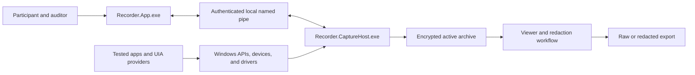

# Threat Model

## Status and scope

- **Status:** Proposed for prototype
- **Related issue:** [Define prototype architecture and collector contracts](https://github.com/bobdodd/windows-a11y-recorder/issues/1)
- **System:** Windows Accessibility Session Recorder
- **Platforms:** Windows 10 and Windows 11 x64
- **Companion policy:** [Privacy and data-handling policy](privacy-and-data-handling-policy.md)

This model covers local session capture, active archive writing, review, redaction, export, retention, and deletion. It does not claim compliance with any specific law or research-ethics framework. Each deployment remains responsible for determining its lawful authority, consent process, participant protections, accessibility accommodations, and incident obligations.

## Security and privacy objectives

The recorder must:

- Capture only channels enabled by an explicit session policy.
- Make active recording and degraded protections visible.
- Prevent silent capture before start, while paused, or after stop.
- Keep raw evidence confidential and tamper-evident.
- Preserve provenance and disclose omissions.
- Keep tested applications and accessibility providers from destabilizing other collectors.
- Avoid transmitting evidence over the network during capture.
- Support review and redaction without modifying raw evidence.
- Make retention and deletion decisions explicit.
- Fail closed when encryption keys, archive paths, or consent state cannot be trusted.

Availability matters because missing evidence can invalidate a study. It does not override confidentiality or participant control.

## Protected assets

### Critical assets

- Raw keyboard records, including possible credentials and private messages.
- Microphone audio and participant speech.
- Display and window video.
- System and screen-reader audio.
- UI Automation text, names, values, selections, bounds, and tree fragments.
- Window titles, process names, paths, and application context.
- Session annotations.
- Accessibility needs, assistive-technology use, and possible disability-related information.
- Encryption keys and recovery material.
- Consent and policy records.

### Integrity-sensitive assets

- Session clock mappings.
- Event and media sequence information.
- Omission and health records.
- Collector configuration and capability results.
- Archive checkpoints and validation results.
- Derived and inferred analysis with evidence links.
- Redaction decisions and export manifests.

### Availability-sensitive assets

- Active session directory.
- Capture-host process and writer queues.
- Media devices and graphics resources.
- Sufficient storage capacity.
- Recovery journal.

## Actors

- **Participant:** Performs tasks and may speak, type, navigate, pause, or withdraw.
- **Auditor or researcher:** Configures and operates the recorder, annotates sessions, and reviews evidence.
- **Archive reviewer:** Receives raw or redacted evidence after capture.
- **Local administrator:** Can potentially inspect process memory, files, devices, or another user's data.
- **Other local user:** Must not gain access through permissive files or machine-scoped keys.
- **Tested application:** Supplies screen content, windows, audio, and UI Automation data and is treated as untrusted.
- **UI Automation provider:** May be slow, malformed, excessively large, or hostile.
- **Device or driver:** Supplies input, audio, display, or media data and may fail or report inconsistent timing.
- **Malware:** May attempt to steal evidence, keys, or participant input.
- **Recorder developer or distributor:** Controls builds, updates, dependencies, and signing.

The prototype does not attempt to resist a malicious administrator or kernel-level compromise. It must state this limitation.

## Trust boundaries

Boundary interpretation:

- User commands cross from human intent into the app and require accessible confirmation.
- App-to-host messages cross a process boundary and require authentication, authorization, validation, and replay protection.
- Instrumented Chromium processes cross a process boundary and require per-session authentication, schema validation, bounded messages, clock mapping, and omission reporting.
- Windows APIs, devices, tested applications, and UI Automation providers cross an untrusted input boundary.
- Evidence crosses from volatile process memory into encrypted storage.
- Review and export cross from protected raw evidence into wider human and device access.

## Assumptions

- Windows is updated according to the deployment's support policy.
- The signed-in user account is not already compromised.
- The application binaries and installer are authentic.
- The user controls the selected archive location.
- No browser or screen-reader plugin is installed by the recorder.
- Ordinary capture runs without elevation.
- The participant can access pause and stop controls.

A test result must state when an assumption is false.

## Threat analysis

### Spoofing

#### Fake application or capture host

An attacker could impersonate either process and send commands, status, or preview data.

Controls:

- Sign release binaries.
- Launch the capture host from an installation directory not writable by ordinary users.
- Verify the child process image path and expected signer.
- Restrict named-pipe access to the current user and expected process.
- Authenticate each launch with a random, short-lived secret.
- Include protocol version, connection identifier, command identifier, and monotonic sequence.
- Reject replayed, oversized, out-of-order, and unknown messages.

#### Misidentified screen-reader process

A similarly named process could be selected for audio capture.

Controls:

- Resolve the executable path, signer, product metadata, process tree, and start time.
- Show the detected product and process to the auditor.
- Require confirmation before process-specific capture.
- Record the exact process identifiers and executable hashes in the session manifest.
- Treat detection as evidence, not proof of product identity.

### Tampering

#### Raw evidence changed after capture

Modification could invalidate research findings or conceal omissions.

Controls:

- Write append-only encrypted chunks.
- Authenticate each chunk and its metadata.
- Chain chunk hashes within each stream.
- Sign or authenticate the terminal manifest.
- Store raw, derived, inferred, and redacted data in separate paths.
- Make the viewer report integrity failures and refuse to present modified raw evidence as valid.

#### Health or omission records suppressed

A collector could lose evidence while presenting itself as healthy.

Controls:

- Give diagnostics reserved capacity independent of evidence queues.
- Maintain atomic omission accumulators when diagnostics queues are full.
- Reconcile source sequence allocation, queue acceptance, persistence sequence, and terminal counts.
- Require archive validation before status becomes completed.
- Treat missing terminal records as partial, not successful.

#### Archive path manipulation

Untrusted names or paths could overwrite files outside the session root.

Controls:

- Generate internal filenames from validated identifiers.
- Canonicalize every path.
- Reject absolute paths, traversal, alternate data streams, device paths, and reparse points outside the root.
- Open files with restrictive sharing and access modes.
- Never use window titles, process names, URLs, or annotation text as path components.

### Repudiation

#### Unclear consent or control history

The operator or participant may dispute which channels were active or whether pause worked.

Controls:

- Record the displayed policy version and selected channels.
- Record explicit consent acknowledgement before capture.
- Persist start, pause, resume, stop, emergency-stop, fallback, and configuration-change boundaries.
- Record command acknowledgements and effective collector boundaries.
- Keep health records active while participant capture is paused.
- Never treat UI display alone as proof that a capture boundary was reached.

#### Unclear export provenance

A reviewer may not know whether a package is raw, redacted, incomplete, or derived.

Controls:

- Give every export a new identifier and manifest.
- Link the export to the source archive by a one-way identifier and hashes.
- Identify removed, transformed, and retained streams.
- Label raw, derived, inferred, and redacted artifacts.
- Record exporter version, policy, time, and operator acknowledgement.

### Information disclosure

#### Credentials and sensitive text captured

System-wide raw input can collect passwords, financial information, medical information, private messages, or unrelated personal data.

Controls:

- Use explicit start and global pause.
- Provide a manual sensitive-entry mode and emergency stop.
- Suppress keyboard payloads when a trusted accessibility signal identifies a password field.
- Record a suppression interval and count without storing keys, scan codes, or text.
- Suspend participant capture on secure-desktop detection.
- Support process exclusions.
- Warn that password detection is incomplete and can be absent, stale, or misleading.
- Require redaction before ordinary sharing.

Password detection is risk reduction, not a confidentiality guarantee.

#### Sensitive data appears in several channels

Removing a keystroke does not remove the same information from video, audio, accessibility text, window titles, or later annotations.

Controls:

- Redaction operates across all enabled channels and matching time ranges.
- The export workflow shows every channel requiring review.
- Redaction reports residual channels that were not inspected.
- Raw archives are never described as safe to share merely because one stream was redacted.

#### Another local user reads an archive

Permissive files or machine-scoped encryption could disclose evidence.

Controls:

- Restrict active directory access to the recording user.
- Encrypt content with a random per-session data-encryption key.
- Protect the local key envelope using user-scoped Windows Data Protection API protection. Microsoft states that data protected with `CryptProtectData` is normally decryptable only by a user with the same credentials on the same computer ([Microsoft DPAPI documentation](https://learn.microsoft.com/en-us/windows/win32/api/dpapi/nf-dpapi-cryptprotectdata)).
- Do not use machine-scoped DPAPI protection for ordinary archives.
- Keep raw keys out of logs, command lines, filenames, and crash reports.
- Clear key material from managed buffers where practical.

#### Network exfiltration

Evidence could be uploaded intentionally or through analytics, update checks, or dependencies during capture.

Controls:

- The capture host contains no evidence-upload, analytics, telemetry, or update client.
- The instrumented browser may access websites selected by the tester, but its evidence bridge connects only to the authenticated local recorder endpoint.
- The app disables update and remote-service calls from preparation through finalization.
- Capture succeeds without network connectivity.
- Dependencies used in the capture host are reviewed for network behavior.
- Network activity is included in integration tests.
- Export and upload are separate post-capture actions requiring explicit user initiation.

#### Crash dumps reveal evidence

Process dumps may contain raw buffers or keys.

Controls:

- Minimize raw-data lifetime in memory.
- Exclude raw payloads from exceptions and logs.
- Disable application-generated full dumps by default.
- Document that operating-system or administrator-configured dumps remain outside the recorder's control.
- Treat dumps collected for support as sensitive archives.

### Denial of service

#### Slow or hostile UI Automation provider

A provider could block calls, generate event floods, or create enormous trees.

Controls:

- Run UI Automation outside the UI and input threads.
- Use strict time, element, depth, property, byte, and rate limits.
- Never traverse a tree from an event callback.
- Coalesce snapshot requests, not captured events.
- Fail the accessibility collector independently.

#### Event or media flood

High-rate input, frames, audio, or accessibility events could exhaust memory or storage.

Controls:

- Prohibit unbounded queues.
- Apply the declared per-channel overflow policy.
- Reserve diagnostics capacity.
- Monitor disk space and projected time remaining.
- Enter degraded state before a hard stop.
- Stop safely when the archive cannot accept required boundaries or diagnostics.

#### Device or encoder failure

A driver reset or encoder stall could block finalization.

Controls:

- Segment media.
- Give operations deadlines and cancellation.
- Isolate media work from input and control.
- Preserve prior complete segments.
- Mark the archive recoverable when finalization cannot complete.

### Elevation of privilege

#### Malicious collector or dependency

A loaded extension could execute with the recording user's authority.

Controls:

- Do not support runtime collector plugins in the prototype.
- Load code only from the protected installation directory.
- Pin and review dependencies.
- Produce a software bill of materials for releases.
- Sign installer and binaries.
- Verify update signatures before installation.
- Do not auto-update during capture.

#### Unsafe parsing

Malformed archives or provider data could exploit the viewer or capture host.

Controls:

- Validate all lengths, counts, enum values, nesting, and identifiers.
- Bound decompression and media parsing.
- Treat archive content as data, never executable markup.
- Keep the viewer non-elevated.
- Do not follow external links or launch embedded content automatically.

## Privacy threat analysis

### Overcollection

The recorder could capture unrelated applications, bystanders, notifications, or conversations.

Controls:

- Show full-display scope before start.
- Offer selected-window capture.
- Support application exclusions.
- Provide per-channel consent.
- Display a persistent recording indicator.
- Keep the default session duration bounded.
- Record only within an explicit session.

### Incorrect inference

Analysis may label behavior incorrectly, especially screen-reader commands inferred from raw evidence.

Controls:

- Keep inference out of capture.
- Preserve observed, derived, inferred, and unknown categories.
- Link every inference to evidence and method version.
- Preserve alternatives and uncertainty.
- Permit human correction without altering raw evidence.

### Accessibility exclusion

Consent, pause, or deletion controls that are inaccessible could remove participant agency.

Controls:

- Make all primary controls keyboard and screen-reader operable.
- Avoid time-limited consent.
- Announce recording and policy changes without stealing focus.
- Provide an emergency-stop chord.
- Test the complete control path with NVDA, JAWS, and Narrator.

### Excessive retention or secondary use

Evidence could be retained indefinitely or reused beyond the stated study.

Controls:

- Set purpose and retention before start.
- Store expiry metadata.
- Prompt for deletion when evidence expires.
- Require a new explicit decision before secondary use or a wider audience.
- Keep export history and recipient purpose.

## Encryption design

The prototype encryption design is:

1. Generate a cryptographically random 256-bit data-encryption key for each session.
2. Protect the local key envelope with user-scoped DPAPI.
3. Encrypt structured streams and media segments in independently recoverable chunks using AES-256-GCM.
4. Use a unique nonce for every chunk under a key.
5. Authenticate session identifier, stream identifier, segment, chunk number, schema version, and prior chunk hash as associated data.
6. Store only minimal bootstrap metadata in plaintext: format version, cryptographic suite, encrypted key envelope, and recovery information that does not identify the participant or tested content.
7. Encrypt the full manifest, filenames where practical, evidence, indexes, annotations, diagnostics, and analysis.
8. Validate every authentication tag before presenting content.

.NET exposes authenticated encryption through `AesGcm` ([Microsoft AesGcm documentation](https://learn.microsoft.com/en-us/dotnet/api/system.security.cryptography.aesgcm)). The exact nonce construction, chunk size, key rotation, portable-export key wrapping, and recovery-key procedure require a focused cryptographic design review and test vectors before participant recording.

Plaintext temporary files are forbidden. Buffers needed for playback or redaction remain in memory or in an explicitly protected working area and are removed when no longer needed.

## Risk register

Scores use severity from 1 to 5 and likelihood from 1 to 5. Residual ratings assume all listed controls are implemented and tested.

| Risk | Inherent S/L | Inherent | Principal controls | Residual S/L | Residual | Owner |
| --- | --- | --- | --- | --- | --- | --- |
| Credentials or private text captured | 5/5 | Critical 25 | Consent, pause, sensitive-entry mode, best-effort password suppression, exclusions, encryption, redaction | 5/2 | High 10 | Product and security |
| Raw archive accessed by another person | 5/4 | Critical 20 | User ACL, per-session encryption, user-scoped key protection, authenticated export | 5/2 | High 10 | Security |
| Raw or insufficiently redacted export shared | 5/4 | Critical 20 | Redacted export default, cross-channel review, explicit raw-export warning, manifest | 5/2 | High 10 | Product and study operator |
| Recording without valid participant understanding | 5/3 | High 15 | Accessible channel-level consent, visible status, pause, withdrawal procedure | 5/1 | Medium 5 | Study operator |
| Collector loss concealed | 4/4 | Critical 16 | Reserved diagnostics, sequence reconciliation, omissions, validation | 4/1 | Low 4 | Engineering |
| UI Automation provider stalls recorder | 3/4 | High 12 | Isolation, timeouts, limits, independent failure | 3/2 | Medium 6 | Engineering |
| Archive tampering changes conclusions | 4/3 | High 12 | AEAD, hash chains, terminal manifest, provenance | 4/1 | Low 4 | Security and analysis |
| Recorder changes participant experience | 4/4 | Critical 16 | Resource budgets, reference baseline, soak tests, health telemetry | 4/2 | Medium 8 | Performance |
| Encryption key lost | 4/3 | High 12 | Key-envelope validation, explicit recovery export, pre-session check | 4/2 | Medium 8 | Product and operator |
| Malware or administrator reads capture memory | 5/3 | High 15 | Least privilege, short-lived buffers, protected host, documented limit | 5/2 | High 10 | Deployment owner |
| Dependency or update compromise | 5/3 | High 15 | Pinning, review, signing, software bill of materials, no capture-time update | 5/2 | High 10 | Release engineering |
| Excessive retention or unauthorized secondary use | 4/4 | Critical 16 | Purpose and expiry metadata, review prompts, export history, deletion workflow | 4/2 | Medium 8 | Study operator |

Residual risks rated High require explicit acceptance before participant data collection. A material data incident, legal complaint, or inability to maintain promised controls requires escalation to the deployment owner's privacy or legal authority.

## Security test requirements

Before participant recording:

- Verify no evidence is captured before start, during pause, or after stop.
- Verify every enabled channel appears in consent and status.
- Saturate every queue and confirm durable omission reporting.
- Attempt named-pipe access from another process and user.
- Attempt archive path traversal and reparse-point escape.
- Corrupt, reorder, remove, duplicate, and replace encrypted chunks.
- Terminate app, host, encoder, and writer processes at different boundaries.
- Lock Windows and trigger secure desktop transitions.
- Enter text in recognized and unrecognized password fields.
- Inspect logs and generated failures for raw data.
- Monitor network activity throughout preparation, capture, and finalization.
- Open malicious and oversized UI Automation trees and archive structures.
- Verify raw and redacted exports cannot be confused.
- Verify encrypted archives cannot be opened by another ordinary local user.
- Verify recovery never converts missing evidence into valid evidence.

## Open security decisions

- Portable export key wrapping and recovery-key user experience.
- Cryptographic chunk sizes, nonce derivation, and key rotation.
- Whether archive filenames require deterministic encryption or opaque identifiers.
- Code-signing certificate custody and release-signing process.
- Update mechanism after the capture prototype.
- Whether optional firewall enforcement is required in managed deployments.
- Crash-dump suppression behavior by Windows edition.
- Deletion verification and backup-discovery behavior.

These decisions require implementation-specific review before participant data is captured.
